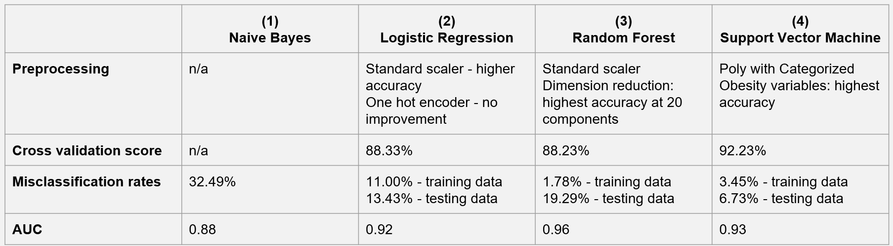

### Overview  

This study examines the correlation between obesity rates and various other factors, utilizing two robust datasets: 
the CDC's PLACES: Census Tract Data (GIS Friendly Format), 2023 release, and the American Community Survey Data from 
the US Census. The PLACES data offers a deep dive into the prevalence of obesity and other chronic conditions, 
as well as lifestyle habits such as physical activity levels, sleep duration, diabetes management, and alcohol 
consumption. The American Community Survey complements this with demographic and socioeconomic insights, encompassing 
factors like median household income and poverty rates within census tracts.  

By merging these datasets, the analysis aims to reveal the associations between obesity prevalence and a spectrum of 
lifestyle choices and socioeconomic conditions at the neighborhood level. The goal is to disentangle the intricate web 
of factors—from individual behaviors to community-wide economic indicators—influencing obesity and chronic disease rates. 
Employing advanced statistical analysis and data visualization tools, the research intends to pinpoint critical determinants 
of obesity, shedding light on the multifaceted nature of health disparities within Michigan's diverse communities. <!--more--> 

### Motivation  

This research is motivated by the urgent need to address the growing burden of obesity, which poses a significant threat 
to public health systems. Obesity is also a major contributor to increased healthcare costs and reduced quality of life. 
Addressing obesity effectively requires a comprehensive approach that accounts for individual behavior and the broader 
societal and environmental determinants of health.  

In Michigan, like in many other regions, the prevalence of chronic diseases varies significantly across different communities, 
suggesting that factors at the neighborhood level may play a critical role in influencing health outcomes. These factors 
include, but are not limited to, socioeconomic status, access to healthcare services, environmental conditions, and the 
availability of resources supporting healthy lifestyles. Moreover, personal behaviors and lifestyle choices, such as smoking, 
physical activity, and dietary habits, interact with these neighborhood factors, creating a complex web of influences that 
affect health.  

Furthermore, understanding the spatial distribution of chronic diseases and their determinants can guide the allocation of 
resources and health services to the communities that need them the most. This is particularly important in a state like 
Michigan, which displays wide variations in economic conditions, racial and ethnic composition, and health outcomes across 
its regions. Through this analysis, the research seeks to contribute to the development of more equitable health policies 
and programs that can adapt to the specific needs of diverse populations, ultimately leading to a healthier, more resilient 
society.  

Specifically, **the "real-world" questions** central to this research are:   
- How do personal health behaviors correlate with the obesity rates across different socioeconomic contexts in Michigan?  
By answering this question, we aim to identify specific behaviors that significantly contribute to chronic diseases within
varying socioeconomic backgrounds. This knowledge could lead to targeted behavioral interventions.  

- Do demographic factors such as race and income level within census tracts in Michigan have a predictive relationship with prevalence of obesity?  
This question seeks to explore the social determinants of health, with the expectation to learn how demographic factors may exacerbate or alleviate the risk of chronic diseases. Insights from this analysis could be pivotal in addressing health disparities and crafting equitable health promotion strategies.  

- What are the most relevant socioeconomic factors and personal health behaviors associated with each chronic disease, and how do these factors compare across different chronic conditions?   
By dissecting the relationships between multiple chronic diseases and a broad range of influencers, we hope to dentify the strongest socioeconomic and behavioral predictors for each chronic disease to understand targeted prevention opportunities.  

In summary, we are willing to utilize the findings to inform public health officials and healthcare providers about which interventions could be most effective for each condition and demographic.The anticipated outcomes of this research include a clearer picture of the socioeconomic and behavioral dimensions of chronic diseases, an understanding of the commonalities and differences in their determinants, and actionable data to guide the crafting of nuanced health promotion campaigns. This will be instrumental in reducing health disparities and enhancing the wellbeing of individuals across Michigan's varied communities.  

### Data Sources  

Our research utilizes two pivotal data sets:  

- **Primary Dataset**:   
  - *Name*: PLACES: Census Tract Data (GIS Friendly Format), 2023 release  
  - *Details*: Contains data on the incidence of chronic diseases and personal health habits (smoking status, sleep duration, frequency of dental visits, alcohol consumption).  
  - *Access*: [CDC Chronic Disease Data](https://data.cdc.gov/500-Cities-Places/PLACES-Census-Tract-Data-GIS-Friendly-Format-2023-/yjkw-uj5s/about_data "cdc_chronic_disease")  

- **Secondary Dataset**:   
  - *Name*: Census-based data on area socioeconomic factors  
  - *Details*: Includes area name, ID and their socioeconomic indicators such as poverty rates, education levels, race, and gender.  
  - *Access*: [US Census Data](https://www.census.gov/programs-surveys/acs/data.html "US CENSUS")  
  - *Scraping Method*: [PyGIS Instructions](https://pygis.io/docs/d_access_census.html "Instructions")  

- **Relationship Between Datasets**:  
    - The datasets we've selected provide a comprehensive view of both chronic disease incidence and the socioeconomic fabric of Michigan's regions. Our primary dataset offers detailed information on health behaviors and chronic disease prevalence. The secondary dataset complements this with socioeconomic data from the census, including area identifiers and demographic information.  
    - In the forthcoming analysis, we will integrate these datasets using unique regional identifiers. This will allow us to delve into a nuanced analysis of how chronic disease rates correlate with personal health practices and socioeconomic conditions, enhancing our understanding of health disparities within Michigan's diverse communities.  

### Data Description  

- Primary Dataset  
    - data selection  
        - We selected some variables related to personal behavior (such as alcohol abuse, smoking, lack of sleep) and some chronic disease variables (arthritis, hypertension, etc.) in the original data set. However, we only selected some chronic diseases as analysis samples, because the data set is a little too large.  
    - list of some key variables  
        - some identifiers like `StateAbbr`,`StateDesc`,`CountyName`,`CountyFIPS`,`Geoid` and `TractFIPS` help us identify the areas;   
        - There are also categories that represent the prevalence of chronic diseases, such as `ARTHRITIS_CrudePrev`,`ARTHRITIS_Crude95CI`, 
        `DEPRESSION_CrudePrev`,`DEPRESSION_Crude95CI`, 
        `DIABETES_CrudePrev`,`DIABETES_Crude95CI` and other such indicators.  
        - There are categories that represent individual behavioural indicators, such as `BINGE_CrudePrev` for the prevalence of alcohol abuse among adults, `CSMOKING_CrudePrev` for the prevalence of smoking among adults, and `SLEEP_CrudePrev` for the proportion of people who sleep less than seven hours.  
    - The DataFrame comprises 2,745 entries, indicating the presence of 1,000 rows indexed from 32376 to 35120. It includes 15 columns, each representing different attributes potentially associated with various health metrics related to chronic diseases across different counties and states. The dataset is complete with no missing values. The columns `StateAbbr` (State Abbreviation) and `CountyName` are of the object type. The column `TractFIPS` is the int64 data type. The remaining columns are of the float64 data type.  

- Secondary Dataset  
    - data selection  
        - We used the API to download the data related to regional socioeconomic indicators in the 2023 U.S. Census from the U.S. Census Bureau's website as variables. Website:[US census](https://www.census.gov/programs-surveys/acs/data.html "US CENSUS")  
    - list of some key variables  
        - we use `Geoid` (renamed as `TractFIPS` for merge purposes) as the area identifier.  
        - We selected some socioeconomic indicators as variables. For example, we select `male` and `female` as gender indicators; we use `black`, `white`, `Asian`, `American Indian`, `Native Hawaiian`, and `other races` as racial indicators. Similarly, we also used income, poverty rate, and education level as variables.  
    - The DataFrame displayed consists of 2,813 entries, suggesting that it contains data across a variety of census tracts, likely numbered from 0 to 2812. It encompasses 20 columns, each representing different attributes which linked to various health metrics and socioeconomic factors related to chronic diseases. The dataset appears almost complete, with only the `Poverty_Rate` column showing a lesser number of non-null entries, indicating some missing values. there are 2,813 (total entries) - 2,740 (non-null entries for 'Poverty_Rate') = 73 missing values in the 'Poverty_Rate' column.  

The columns are a mix of data types: the `NAME`, `state`, `county`, and `tract` columns are of the object type, presumably containing textual data. The `TractFIPS` column is of the int64 data type, likely a numerical identifier for each tract. All other columns, which include demographic information such as `Total_Population`, `Male`, `Female`, as well as race categories and socioeconomic indicators like `Median_HH_Income` and `Poverty_Rate`, are of the float64 data type. This structure suggests a detailed and rich dataset suitable for in-depth analysis of chronic disease factors at the tract level within Michigan.  

### Descriptive Statistics  

#### Histogram of Health Outcome  

#### Visualizaiton of Population by Race in Percentage  

This diagram shows the racial composition across 50 randomly selected census tracts, with each racial group represented by a unique color. The population percentages are scaled to a total of 100% for comparative purposes. It should be noted that the Hispanic population overlaps with other racial categories; therefore, when all groups are combined, the total percentage exceeds 100%. This overlap allows for a detailed examination of the distribution and concentration of the Hispanic population alongside other groups. For clarity, the representation of the Hispanic population extends beyond the 100% mark to highlight its integration with other racial demographics.  

Observations include:  

- **White Population:** Predominantly the majority in most of the census tracts.  
- **African American Population:** Significant concentrations of African American residents dominate in certain tracts.  
- **Hispanic, Asian and Other Racial Group:** There is a noticeable agglomeration of Hispanic individuals in several tracts, with the Asian and other racial groups also showing presence but to a lesser extent.  

#### Visualization of Median Household Income by County  

In order to observe the distribution of median household income, the data has been further aggregated by county. Ten county were randomly selected in this process. The violin charts depict the distribution of median household income in the 10 counties respectively. Each diagram demonstrates the median household income distribution from the census tracts of each county. For example, Lenawee county is relatively wealthier, the median value of median household income is above 50,000. Berrien county has smaller gap among wealthier and less wealthy households. Genesee county's median value of median household income is around 30,000, lower than other counties.  

### Multivariate Analysis  

#### Correlation Matrix and Visualization  

Due to the large number of variables, we break this visualization into two steps. In the firs step, we would like to focus on the correlation of all health outcome (from the primary dataset - CDC PLACE). Then the merged dataset is uesd to visualize correlation among all health related along with socio-economic fators.  

The heatmap uses a red-blue color scheme (`coolwarm`). Blue represents a a positive correlation, red represents a negative correlation, and the intensity of the color indicates the strength of the correlation.  

- **Red (Positive Correlation):** Darker shades of red indicate a stronger positive correlation, where an increase in one condition tends to be associated with an increase in another. Lighter shades of red indicate a weaker positive correlation.  
- **Blue (Negative Correlation):** Darker shades of blue indicate a stronger negative correlation, where an increase in one condition tends to be associated with a decrease in another. Lighter shades of blue indicate a weaker negative correlation.  

**Significant Correlations Between Obesity and Other Conditions**  

1. **Obesity and Physical Activity:** There appears to be a strong positive correlation between obesity and physical activity (as indicated by a dark red color). This suggests that higher levels of lacking physical activity are associated with lower levels of obesity.  
2. **Obesity and Sleep Less Than 7 Hours:** There was a strong positive correlation indicated (around 0.84), suggesting that individuals with obesity may also experience less sleep (fewer than 7 hours), or vice versa.  
3. **Obesity and Diabetes:** A strong positive correlation was also noted between obesity and diabetes, which is consistent with medical understanding that obesity can be a risk factor for type 2 diabetes.  
4. **Obesity and Stroke:** There seemed to be a positive correlation between obesity and stroke, which aligns with the known health risks associated with obesity.  
5. **Obesity and Fair or Poor Health:** A positive correlation between obesity and fair or poor health suggests that  higher levels of obesity within the dataset could be associated with a higher probability of having fair or poor health status.  
6. **Obesity and Binge Drinking:** The blue coloring suggests a negative correlation between obesity and binge drinking. This means that as binge drinking increases, obesity levels tend to decrease, and vice versa.  

Beside correlation among health conditions, we would like to further understand the correlation among health and socio-economic factors. This heatmap demonstrates correlation among such variables using green for positive correlation and pink for negative one.  

- **Green (Positive Correlation):** Darker shades of red indicate a stronger positive correlation. Lighter shades of red indicate a weaker positive correlation. Zero is dislayed in white.  
- **Pink (Negative Correlation):** Darker shades of blue indicate a stronger negative correlation. Lighter shades of blue indicate a weaker negative correlation.  

**Significant Correlations Among Health and Socio-economic Features**  

1. **Education and Disease Occurance:** Education background has been categorized into those holding a bachelor's degree and above, and those who have not attended university. It is stunning how education background shows negative correlation with disease occurance (including diabetes, obesity and stroke, bad mental and physicla health) and risky health behaviors (including sleeping less, smoking, lack of exercises).  
2. **Poverty Rate and Disease Occurance:** Poverty rate also shows a strong positive correlation with most disease occurance and bad health behaviors. This includes diabetes, obesity, poor mental and physical health, smoking, sleeping less, and lack of exercise - all of these features show over 0.5 correlation.  
3. **Race and Disease Occurance:** Both white and black population demonstrate strong correlation with disease occurance and risky health behaviors, wheras in oppisite patterns. White population shows strong negative correlation with smoking, diabetes, obesity, stroke, sleeping less, and poor physical health. As comparison, black population unveils positive correlation with these factors. However, white population has strong positive correlation with binge drinking, whereas black population shows strong negative correlation.  
4. **Household Financial Status and Disease Occurance:** Similarly, the median household income also demonstrates a strong negative correlation with the occurance of dieases including stroke, obesity, dieabtes, etc., as well as poor health behaviors such as lack of exercise and sleep. However, household income shows strong correlation with binge drinking.  

#### Pairplot by Dominant Race Group  

To add a dimention to the pairplot, the original numeric data for racial groups have been converted to categorical data. The method is to pick the dominant group in population and create a new column with the race as the value. This is a relatively simple and brutal approach for the purpose of data visualization.  

Pairplots of selected variables are depicted in the chart above. We would like to focus on the correlation of other variables with obesity.  
**Health outcome:**  lack of sleep, lack of physical activity, and stroke show positive correlation with the occurence of obesity. Depression and binge drinking shows negative correlation with the occurence of obeisty.  
**Racial groups:** the majority census tracts are dominated by either white or black population. The census tracts with the same dominant groups shows agglomerations in the distribution. For example, with the same level of blood pressure, white population has lower obesity occurence as compared to black population. On the contrary, white population shows higher chance in binge drinking, but obesity occurence is still relatively higher with the black population.  

### Comparative Analysis  

The scatterplots represent the relationships between the obesity rate and the percentages of various racial demographics within the dataset. Each plot corresponds to a different racial demographics, and the correlation coefficient (rr
r) for each relationship is provided in the title of the respective plots.  

* White Population Percentage (White_Pct) has a negative correlation of -0.61 with obesity rates. This indicates that as the percentage of the White population increases within a county, obesity rates tend to decrease. The scatter plot with blue points reinforces this relationship, showing a downward trend as the White_Pct increases.  
* Black Population Percentage (Black_Pct) is positively correlated with obesity rates, having a correlation coefficient of 0.66. This suggests that counties with a higher percentage of Black residents are likely to have higher obesity rates. The green points in the scatter plot generally rise as the Black_Pct increases, illustrating this positive relationship.  
* American Indian Population Percentage (American_Indian_Pct) shows a very weak positive correlation with obesity rates, at a coefficient of 0.04. This weak correlation implies that there is little to no discernible trend between the percentage of American Indian residents and obesity rates within counties. The red points on the scatter plot are distributed without a clear pattern, indicating the lack of a strong association.  
* Asian Population Percentage (Asian_Pct) has a moderate negative correlation of -0.37 with obesity rates. This relationship implies that counties with larger Asian populations might be associated with lower obesity rates. The scatter plot with purple points displays a trend where points tend to decline as the Asian_Pct increases, supporting the negative correlation observed.  
* Hawaiian Islander Population Percentage (Hawaiian_Islander_Pct) presents an almost non-existent negative correlation of -0.01 with obesity rates. The negligible correlation coefficient indicates no meaningful relationship between the Hawaiian Islander population percentage and obesity rates, as visualized by the orange points scattered randomly across the scatter plot.  
* Other Race Population Percentage (Other_Race_Pct) has a weak positive correlation of 0.13 with obesity rates. This correlation coefficient suggests that there is a slight tendency for counties with higher percentages of residents identified as 'Other Race' to have marginally higher obesity rates. However, as seen in the scatter plot with red points, the relationship is not strongly pronounced.  
* Hispanic Population Percentage (Hispanic_Pct) is weakly positively correlated with obesity rates, with a correlation coefficient of 0.11. This indicates that there might be a slight increase in obesity rates in counties with higher Hispanic residents, although the relationship is not firmly defined. The light red points in the scatter plot show a very gentle upward trend, which is consistent with the weak correlation value.  

By merging these two datasets, we can more accurately assess the correlation between obesity rates and racial demographics within individual counties in Michigan. These correlations between racial demographics and obesity rates suggest varied impacts on different communities. While some demographics, like White, Black, and Asian populations, show stronger negative and positive correlations, respectively, others, such as the American Indian, Hawaiian Islander, and Hispanic populations, display weaker associations.  

#### Assessing the Relationship Between Household Income and Obesity Rates  

The median household income in counties with higher obesity rates tends to be lower than that in those with lower obesity rates. For instance, Genesee County, with one of the highest obesity rates, has a median household income of approximately $43,432. In contrast, Livingston County, which falls into the lower obesity rate category, shows a substantially higher median household income of approximately $74,590.  

This pattern suggests an inverse relationship between median household income and obesity rates, where counties with lower median household incomes tend to have higher obesity rates. Conversely, counties with higher median incomes, such as Livingston and Oakland, display lower obesity rates. This trend aligns with the narrative that socio-economic factors, including income, play a crucial role in the health outcomes of a population. Higher incomes may correlate with better access to healthy food options, recreational activities, and healthcare services, which can contribute to lower obesity rates. 

In the high-obesity counties—Genesee, Monroe, Muskegon, Saginaw, and Tuscola—the poverty rates are notably higher on average than in the counties with lower obesity rates. Genesee and Saginaw Counties have poverty rates exceeding 20%, while Monroe County presents a lower rate of approximately 9.7%, still within the high-obesity group. This pattern suggests a correlation where higher obesity rates coincide with higher poverty rates.  

Turning to the counties with lower obesity rates—Grand Traverse, Kent, Livingston, Oakland, and Washtenaw—we see generally lower poverty rates, with Livingston County standing out at approximately 6.2%. This indicates that counties with lower obesity rates also tend to have lower poverty rates, reinforcing the notion that socio-economic factors like poverty influence health outcomes, including obesity prevalence.  

#### Examining the Correlation Between Chronic Diseases, Lifestyle Factors, and Obesity Rates  

We selected these chronic disease and lifestyle factors as variables because they have shown strong positive or negative correlations with obesity in previous analyses. To more effectively communicate these relationships, we have drawn scatter plots and included correlation coefficients, facilitating a rapid assessment of the associations.  

### Inferential Analysis  

#### MODEL 1: Multiple Linear Regression Model (Obesity as the dependent variable. Multiple indicators of personal lifestyle habits as the dependent variable.)  

- $Y$:`Obesity`; $X_1$:`PhysicalActivity`; $X_2$:`SleepLess7Hrs`; $X_3$:`Diabetes`; $X_4$:`Stroke`; $X_5$:`FairPoorHealth`; $X_6$:`BingeDrinking`  
- $Y=\beta_0+\beta_1X_1 +\beta_2X_2 + \beta_3 X_3 + \beta_4 X_4+ \beta_5 X_5 + \beta_6 X_6 + \epsilon$  
- $H_0:\beta_1=\beta_2=\beta_3=\beta_4=\beta_5=\beta_6=0$  
- $H_A$: at least one $\beta_i$ is non-zreo  
- Confidence Interval: We chose a 99% confidence interval.  
- We chose the variables in this way because we attempted to illustrate the linear relationship between obesity and indicators of personal lifestyle habits through multiple linear regression modeling.  

So the funcution can be expressed as: $\text{Obesity} = -4.3476 + 1.0794 \times \text{PhysicalActivity} + 0.2330 \times \text{SleepLess7Hrs} + 
2.7568 \times \text{Diabetes} - 4.7811 \times \text{Stroke} - 1.0357 \times \text{FairPoorHealth} + 0.6658 \times \text{BingeDrinking} + \varepsilon$  

**Interpretation**  
- For the t-test:  
  - const: The intercept is -4.3476 and the p-value is almost 0 which means it is statistically significant.  
  - `PhysicalActivity`: The coefficient of physical activity ($\beta_1$) is 1.0794 with a p-value of almost 0 indicating that lack of physical activity is positively associated with obesity and this result is statistically significant.  
  - `SleepLess7Hrs`: The coefficient of SleepLess7Hrs ($\beta_2$) is 0.2330 with a p-value of almost 0, indicating that lack of sleep is positively associated with obesity and this result is statistically significant.  
  - `Diabetes`: The coefficient of Diabetes ($\beta_3$) is 22.7568 with a p-value of almost 0, indicating that diabetes is positively and statistically significant associated with obesity.  
  - `Stroke`: The coefficient of Stroke ($\beta_4$) is -4.7811 with a p-value of almost 0, indicating that Stroke is negatively associated with Obesity and this result is statistically significant.  
  - `FairPoorHealth`: The coefficient of poor health ($\beta_5$) is -1.0357 with a p-value of almost 0, indicating that poor health is negatively associated with obesity and this result is statistically significant.  
  - `BingeDrinking`: The coefficient for Binge Drinking ($\beta_6$) is 0.6658 with a p-value of almost 0, indicating that Binge Drinking is positively and statistically significantly associated with Obesity.  

#### MODEL 2: Analysis of variance: assessing the effect of race on obesity rates  

- $Y$:`Obesity`; $X_1$:`White`; $X_2$:`Black`; $X_3$:`American_Indian`; $X_4$:`Asian`; $X_5$:`Hawaiian_Islander`; $X_6$:`Other_Race`  
- $H_0$: There is no significant difference in the mean obesity rate between the races.  
- $H_A$: At least one race has a different mean obesity rate than the other races.  
- Significance Level: 0.05  

**Interpretation**  
- The value of F-statistic is large while the p-value is 0.0<0.05. we have enough evidence to reject the null hypothesis, i.e., to support the alternative hypothesis that there is a significant difference in the mean value of obesity rates among the races.  
**Why ANOVA?**   
- We chose the chi-square test to examine whether race has a significant effect on obesity rates because the race variable is a categorical variable of more than three, whereas obesity rates are a continuous variable. And ANOVA is very effective in comparing differences between the means of three or more samples.  

#### MODEL 3: multiple linear regression model(Obesity as the dependent variable. Median Household income,poverty rate and education level as the dependent variables.)  

- $Y$:`Obesity`; $X_1$:`Median_HH_Income`; $X_2$:`Bachelors_Below`; $X_3$:`Poverty_Rate`  
- $Y=\beta_0+\beta_1X_1 +\beta_2X_2 + \beta_3 X_3 + \epsilon$  
- $H_0:\beta_1=\beta_2=\beta_3=0$  
- $H_A$: at least one $\beta_i$ is non-zreo  
- Confidence interval: we chose a 95% confidence interval.  
- We chose the variables in this way because we attempted to illustrate the linear relationship between obesity and Races through multiple linear regression modeling.  

So the function can be expressed as: 
$Obesity = 37.3338 - 0.0001 \times MedianHHIncome + 0.0009 \times Bachelors Below + 18.1603 \times PovertyRate + \varepsilon$ 

#### Interpretation  
- For the t-test:  
  - `const`: The intercept is 37.3338, and the p-value is almost 0 which means it is statistically significant. This suggests a baseline obesity prevalence when all predictor variables are set to zero.  
  - `Median_HH_Income`: The coefficient of median household income ($\beta_1$) is -0.0001 with a p-value of almost 0, indicating that as median household income increases, obesity rates slightly decrease, and this result is statistically significant.  
  - `Bachelors_Below`: The coefficient for the population with education below a bachelor's degree ($\beta_2$) is 0.0009 with a p-value of almost 0, suggesting that the obesity rate for those without a bachelor's degree is 0.009 units higher than the obesity rate for those with a bachelor's degree.  
  - `Poverty_Rate`: The coefficient for the poverty rate ($\beta_3$) is 18.1603 with a p-value of almost 0, indicating a strong positive association with obesity rates, and this result is statistically significant.  
- For R-squared value:  
  - The R-squared value of the model is 0.499, which implies that approximately 49.9% of the variability in obesity is explained by the model. Given the statistical significance of the variables and the model's explanatory power, there is a strong case for its consideration in production environments, provided that there is an understanding of the implications and limitations associated with the socio-economic factors in question.   

#### MODEL 4: multiple linear regression model(Obesity as the dependent variable. Individual lifestyle habit indicators and socio-economic indicators as dependent variables.)  

- $Y$:`Obesity`; $X_1$:`PhysicalActivity`; $X_2$:`SleepLess7Hrs`; $X_3$:`Diabetes`; $X_4$:`Stroke`; $X_5$:`FairPoorHealth`; $X_6$:`BingeDrinking`; $X_7$:`Median_HH_Income`; $X_8$:`Bachelors_Below`; $X_9$:`Poverty_Rate`  
- $Y=\beta_0+\beta_1X_1 +\beta_2X_2 + \beta_3 X_3 + \beta_4 X_4 + \beta_5 X_5 + \beta_5 X_5 + \beta_6 X_6 + \beta_7 X_7 + \beta_8 X_8 + \beta_9 X_9 + \epsilon$  
- $H_0:\beta_1=\beta_2=\beta_3=\beta_4=\beta_5=\beta_6=\beta_7=\beta_8=\beta_9=0$  
- $H_A$: at least one $\beta_i$ is non-zreo  
- Confidence Interval: We chose a 99% confidence interval.  
- We chose the variables in this way because we attempted to illustrate the linear relationship between obesity and indicators of Individual lifestyle habit and socio-econmic through multiple linear regression modeling.  

The regression function can be expressed as:  
$Obesity = 0.7823 + 0.8982 \times PhysicalActivity + 0.2676 \times SleepLess7Hrs + 2.7900 \times Diabetes - 5.1028 \times Stroke - 0.9069 \times FairPoorHealth + 0.5433 \times BingeDrinking - 0.000044 \times MedianHHIncome + 0.0004 \times BachelorBelow - 2.5195 \times PovertyRate + \varepsilon$  

**Interpretation**  
- For the t-test: 
  - `const`: The intercept is 0.7823 with a p-value of 0.479, indicating it is not statistically significant.  
  - `PhysicalActivity`: The coefficient $\beta_1$ is 0.8982 with a p-value close to 0, signifying a positive and statistically significant association with obesity.  
  - `SleepLess7Hrs`: The coefficient $\beta_2$ is 0.2676 with a p-value close to 0, also indicating a positive and statistically significant association with obesity.  
  - `Diabetes`: The coefficient $\beta_3$ is 2.7900 with a p-value close to 0, suggesting a strong positive and statistically significant association with obesity.  
  - `Stroke`: The coefficient $\beta_4$ is -5.1028 with a p-value close to 0, indicating a negative and statistically significant association with obesity.  
  - `FairPoorHealth`: The coefficient $\beta_5$ is -0.9069 with a p-value close to 0, suggesting a negative and statistically significant association with obesity.  
  - `BingeDrinking`: The coefficient $\beta_6$ is 0.5433 with a p-value close to 0, showing a positive and statistically significant association with obesity.  
  - `Median_HH_Income`: The coefficient $\beta_7$ is -0.000044 with a p-value close to 0, indicating that higher income levels are negatively associated with obesity rates in a statistically significant way. But the association is weak.  
  - `Bachelors_Below`: The coefficient $\beta_8$ is 0.0004 with a p-value of 0.600, showing no statistically significant association with obesity.  
  - `Poverty_Rate`: The coefficient $\beta_9$ is -2.5195 with a p-value close to 0, which is a strong negative and statistically significant association with obesity.  

The R-squared value of 0.880 suggests that the model explains 88% of the variability in obesity rates. This high explanatory power implies a strong fit of the model, yet the significant coefficients should be considered with caution due to potential multicollinearity, as indicated by the large condition number. Careful consideration should be taken if deploying this model in a production environment.  

### EDA Reflection  

#### Synthesis  

The synthesis of descriptive and inferential statistics, alongside graphical analyses, has illuminated the complex relationship between racial demographics, health conditions, lifestyle factors, and obesity rates within Michigan's diverse counties. Our research questions centered on understanding these relationships and identifying any significant patterns that could inform public health initiatives.  

Merging the CDC's PLACES data and the American Community Survey Data from the US Census has provided a comprehensive lens through which to view these correlations. This combined dataset enhances the reliability of the observed statistical associations and offers a more granular insight into the socioeconomic and behavioral factors at play. Such an integrated approach allows for a more robust analysis than what could be achieved with each dataset in isolation, leading to actionable intelligence that can drive targeted interventions to combat obesity at the community level.  

#### Key Findings  

* Racial composition appears to correlate with obesity prevalence across counties, as suggested by comparative analysis.  
* The Black community has been found to have a positive correlation with higher obesity rates. Conversely, the White population demonstrates a negative correlation with obesity rates.  
* Through inferential statistics, it can be concluded that there is a strong statistical correlation between race and obesity. Among them, white people have lower obesity rates than ethnic minorities.  
* Health outcome and health related behaviors also show correlation with the occurence of obesity. While all physical health outcomes show positive correlation with obesity rates, mental health depicts negative correlation with the obesity rates. Similarly, while other negative health behaviors show positive correlation with obesity rates, binge drinking, however depicts a negative pattern in the association with obesity occurence.  
* In the multiple regression analysis, after adding socioeconomic indicators (median household income, education level, and poverty rate), the coefficient β of personal habit indicators (such as sleep time, exercise duration, etc.) in the multiple regression equation mostly decreased, proving that socioeconomic factors Indicators are also relevant factors affecting obesity.  

#### Limitations  

One notable limitation in our analysis arises from the interpretation of p-values. A p-value of 0.0, as observed in our comparative analysis, often indicates a very small p-value rounded down due to the large dataset size. While it suggests a statistically significant correlation, this does not necessarily imply a strong or meaningful relationship in a practical sense. The large sample size can lead to very small p-values, even for minor associations that may not be of practical importance.  
Furthermore, our analysis may be constrained by the inherent biases within the datasets, such as reporting biases or selection biases, which could skew the results. Using aggregated data at the county level may also mask significant variations within smaller geographical units or specific subpopulations.  
In US Census, race and ethnical are two different ways to categorize population. We chose race categories and calculated Hispanic population manually for comparison. Hispanic population was compared with the other racial groups in the descriptive statistics. However, with the consideration of overlaping population, we opted to stick with racial categories in the rest part of the analysis.  
In experiment with different data visualization and analytics techniques, since the values in our datasets are numeric, some techniques such as pivot table would not be applied here. We did create a categorical column converting racial data into the dominant group. The new column is proper for multi-dimentional pairlot visualization whereas still not desired to establish a pivot table.  

## Machine Learning  

In this session, we will delve into various machine learning models to maximize prediction accuracy or minimize the misclassification rate of the response variables. Data preprocessing is an essential adjunct to each model's design, as different machine learning models may necessitate distinct preprocessing steps. This notion extends to the selection of variables; depending on the model, various combinations of variables can significantly influence the emerging patterns.  

**Variables Selection methodology:**  
* Variables are selected in different combination to achieve a higher accuracy.   

**Response variable:**  
* Response variable has been trasnformed both into categorical and binary values. Both categorical and binary variable have been applied in separatate modes to expriment to find the optimal result.  

**Methodology Selection for Preprocessing:**   
* Since the independent variables are primarily continuous, the initial phase will focus on standard scaling and dimensionality reduction. The efficacy of these methods will likely vary across different models and will be assessed individually.  
* During preprocessing, one-hot encoding was tested to transform the categorical variable representing the predominant racial group. Observations indicate that the outcomes using one-hot encoded racial variables are strikingly similar to those obtained with the percentage representation of racial groups. Consequently, we will primarily employ the percentage variables in most models.  

#### Naïve Bayes  

* Accuracy: The overall accuracy of the model is approximately 78.51%. This indicates that about 78.51% of all predictions made by the model are correct, reflecting the proportion of total true positive and true negative predictions out of all predictions made.  
* Classification Report: While the model is reasonably accurate overall, the differences in performance metrics for the two classes suggest that further optimization may be possible, especially in improving recall for the class "High."  

#### Logistic Regression  

* Preprocessing: Model #3 processes the independent variables using a standard scaler, which achieves higher accuracy.  
* Accuracy: The model achieves an overall accuracy score of 88.33%, indicating that about 88.33% of all predictions are correct.  
* Misclassification Rate: The model's misclassification rate is 11% for the training data and 13.43% for the testing data.  

#### Random Forest  

* Preprocessing: The model uses a standard scaler and dimension reduction to process independent variables. The accuracy is the highest when the number of components is 20. This is the best model for the Random Forest method.  
* Accuracy: The model achieves an overall accuracy score of 88.23%, indicating the proportion of all predictions being correct.  
* Misclassification Rate: The model has a misclassification rate of 1.78% for the training data and 19.29% for the testing data.  

#### Support Vector Machine  

* In assessing the effectiveness of the SVM models, both the radial basis function (rbf) and the polynomial (poly) kernel were employed. When Obesity is considered as a binary variable into Low and High categories, the polynomial kernel SVM demonstrated superior accuracy, registering at 0.88. However, when the obesity rate was expanded into three categories—Low,Medium, and High —the distinction in performance between the rbf and poly kernels was marginal, with scores of 0.92 and 0.91, respectively.  
* In a comparative analysis with other machine learning models, including Bayes, logistic regression, and random forest, the SVM models outperformed their counterparts, achieving the highest accuracy metrics.  

 

The graph above represents the Receiver Operating Characteristic (ROC) curves for four machine learning models: Naïve Bayes, Logistic Regression, Random Forest, and Support Vector Machine (SVM). The ROC curve plots the True Positive Rate (TPR) against the False Positive Rate (FPR) at various threshold settings, and the Area Under the Curve (AUC) provides a single-value summary of the ROC curve's performance.  

**Naïve Bayes (AUC = 0.88):** The blue curve represents the Naive Bayes classifier. An AUC of 0.88 indicates good predictive performance, but there is room for improvement compared to the other models. The curve is closer to the top-left corner than a random guess (the diagonal line) but not as close as the other models.  
**Logistic Regression (AUC = 0.92):** The orange curve shows the Logistic Regression model. An AUC of 0.92 is indicative of excellent performance, with the model offering a strong separation between the positive and negative classes.  
**Random Forest (AUC = 0.95):** The green curve describes the Random Forest classifier. The AUC of 0.95 is the highest among the four models, suggesting that Random Forest has the best overall performance in terms of distinguishing between the classes.  
**SVM (AUC = 0.93):** The red curve represents the Support Vector Machine model with an AUC of 0.93, which is very close to the performance of Logistic Regression and signifies a high predictive ability.  

General Observations:  

The Random Forest model exhibits the highest predictive ability among the evaluated models, closely followed by SVM and Logistic Regression.  

Naïve Bayes, while still performing well, has the lowest AUC score of the models presented, indicating it has a slightly lower ability to differentiate between the classes than the other models.  
All models show strong predictive power, with Random Forest leading slightly. Such ROC curves help visualize and compare the trade-offs between true positive rates and false positive rates across different models, thus guiding the selection of the most appropriate model for a given task.  

#### Finding: ROC-AUC vs Accuracy: Which Metric Is More Important?  

Upon evaluating the machine learning models, it emerged that the performance outcomes differed notably when measured by ROC-AUC and Accuracy metrics. While the naïve Bayes, logistic regression, random forest, and SVM models generally delivered robust results—scoring near or beyond the 0.9 mark for both AUC and accuracy—the **random forest model** excelled in ROC-AUC with a score of **0.95**. Conversely, the **SVM model** achieved the highest accuracy at **0.93**.  

When it comes to the question of which metric is more compelling, the answer hinges on the data distribution. Accuracy tends to be a suitable metric for uniformly distributed data. However, ROC AUC assumes greater importance with imbalanced datasets, considering the balance between precision and recall, while accuracy might be misleading if the data distribution is skewed.  

Typically, ROC AUC is reserved for binary variable assessments. In this study, the obesity rate demonstrated a more balanced distribution as a binary variable (`Low`: 1380, `High`: 1350) compared to its distribution as a categorical variable (`Medium`: 1569, `Low`: 911, `High`: 250). Hence, we contend that the ROC AUC metric offers a more accurate reflection of a model’s efficacy for this dataset, with the random forest model emerging as the top performer amongst the four contenders.  

 
 

  This is the term project of **SI618: Data Manipulation and Analysis** at the University of Michigan. The project is 
  co-authorized by Jessie Hu, Huanyu Ren and Elizabeth Wang, with equal work division.  

